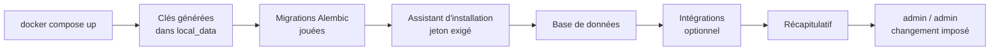
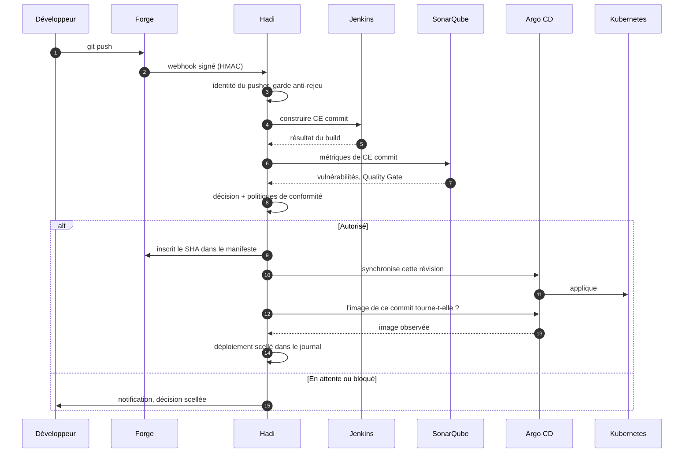
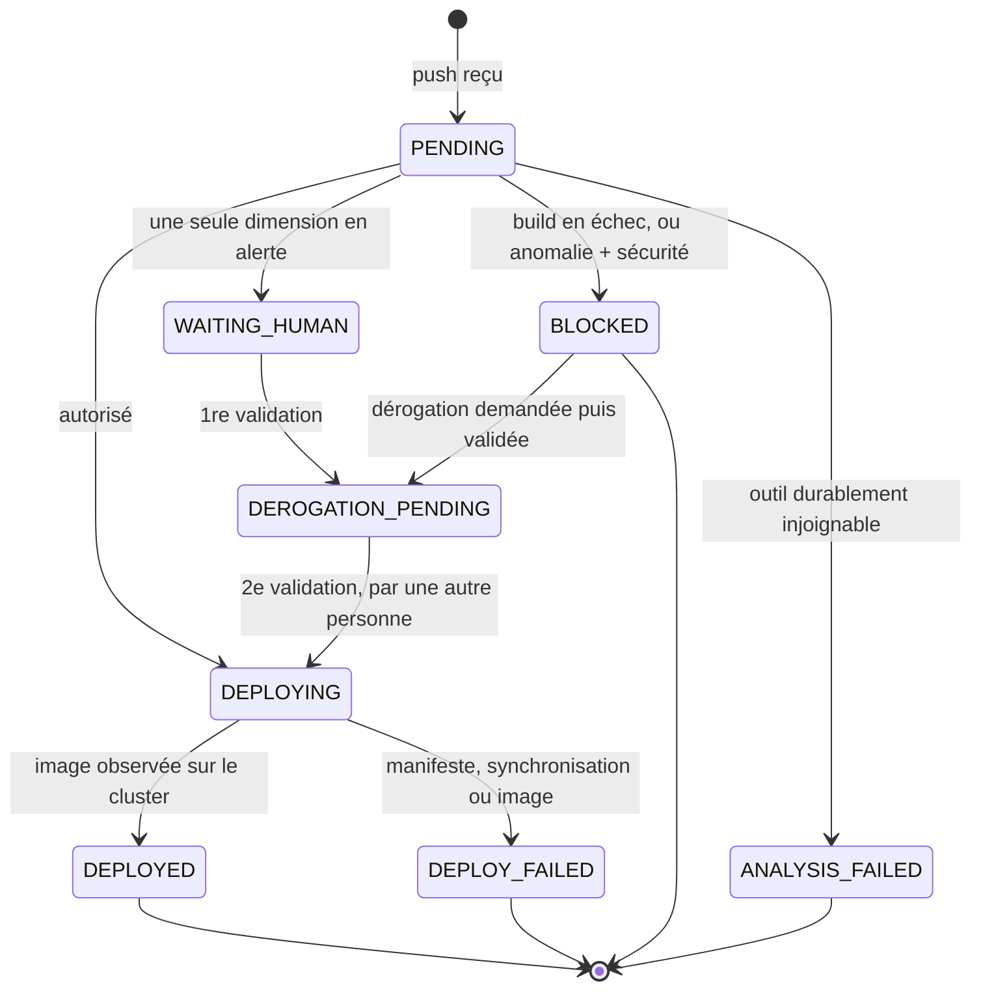
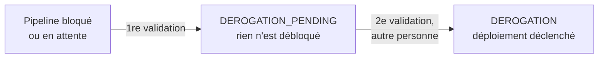
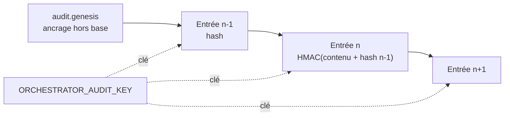
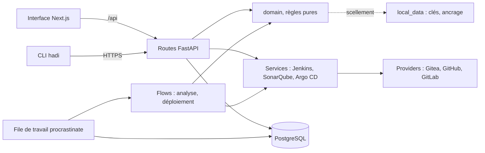

<div align="center">


# Hadi

**Une passerelle de décision entre votre dépôt et votre production.**

Hadi s'intercale dans votre chaîne CI/CD existante : il écoute les pushs, fait construire et analyser le commit reçu, confronte les preuves obtenues à des règles explicites, puis **décide** : autoriser, mettre en attente un humain, ou bloquer. Chaque décision et chaque déploiement sont inscrits dans un journal scellé, vérifiable à tout instant.

[](LICENSE)
[](https://www.python.org/)
[](https://fastapi.tiangolo.com/)
[](https://nextjs.org/)
[](https://www.postgresql.org/)
[](https://docs.docker.com/compose/)
[](.github/workflows/ci.yml)

**[Démarrer](#2-démarrage)** · **[Fonctionnement](#3-comment-ça-marche)** · **[Brancher vos outils](#6-brancher-vos-outils)** · **[Configuration](#9-configuration)** · **[API](#10-référence-de-lapi)** · **[CLI](#11-client-en-ligne-de-commande)** · **[Sécurité](#12-modèle-de-sécurité)** · **[Dépannage](#15-dépannage)**

</div>

---

## Sommaire

<table>
<tr><td valign="top" width="33%">

**Comprendre**

1. [Le problème](#1-le-problème)
2. [Démarrage](#2-démarrage)
3. [Comment ça marche](#3-comment-ça-marche)
4. [Le moteur de décision](#4-le-moteur-de-décision)
5. [Fonctionnalités](#5-fonctionnalités)

</td><td valign="top" width="33%">

**Mettre en place**

6. [Brancher vos outils](#6-brancher-vos-outils)
7. [Rôles et permissions](#7-rôles-et-permissions)
8. [Modules](#8-modules)
9. [Configuration](#9-configuration)
10. [Référence de l'API](#10-référence-de-lapi)
11. [Client en ligne de commande](#11-client-en-ligne-de-commande)

</td><td valign="top" width="33%">

**Exploiter et contribuer**

12. [Modèle de sécurité](#12-modèle-de-sécurité)
13. [Données et sauvegarde](#13-données-et-sauvegarde)
14. [Exploitation](#14-exploitation)
15. [Dépannage](#15-dépannage)
16. [Architecture du code](#16-architecture-du-code)
17. [Développement](#17-développement) · [Tests](#18-tests-et-qualité)
18. [Portabilité](#19-portabilité) · [Feuille de route](#20-feuille-de-route)
19. [Questions fréquentes](#21-questions-fréquentes) · [Glossaire](#22-glossaire)

</td></tr>
</table>

---

## 1. Le problème

Une chaîne CI/CD classique enchaîne build, tests, analyse, déploiement. Chaque outil fait son travail, mais **personne ne décide** : si l'analyse de sécurité n'a pas tourné, le déploiement passe quand même ; si elle a tourné sur un autre commit, personne ne s'en aperçoit ; et quand quelqu'un force un déploiement un vendredi soir, il ne reste qu'une ligne dans un journal que n'importe qui peut réécrire.

Hadi répond à trois questions que les outils, pris séparément, ne posent pas :

| Question | Réponse de Hadi |
|---|---|
| **Ce commit précis a-t-il été analysé ?** | L'analyse SonarQube est corrélée au SHA reçu. Absente ou portant sur un autre commit, elle vaut *non vérifiable* : jamais *propre*. |
| **Qui a autorisé ce déploiement, et sur quelles preuves ?** | Chaque décision est scellée (HMAC chaîné) avec les preuves qui l'ont motivée et le critère appliqué. |
| **Ce qui tourne en production correspond-il à ce qui a été approuvé ?** | Le SHA approuvé est inscrit dans le manifeste, Argo CD synchronise cette révision, et « déployé » n'est posé qu'après avoir **observé l'image sur le cluster**. |

### Les quatre principes

| Principe | Ce qu'il implique concrètement |
|---|---|
| **Fail-closed** | En l'absence de preuve, rien ne passe. Une métrique absente ne vaut jamais zéro : elle vaut `UNVERIFIABLE` (`-1`) et déclenche une validation humaine. |
| **La preuve avant le statut** | `DEPLOYED` n'est écrit qu'après avoir relu l'image du commit sur l'application Argo CD. Un statut qui ne correspond à rien sur le cluster est pire qu'un échec. |
| **Ajout seul** | Aucune décision n'est modifiée ni supprimée : une nouvelle entrée référence celle qu'elle remplace (`supersedes_audit_id`). Le refus est tenu par un déclencheur PostgreSQL, pas seulement par l'application. |
| **Explicabilité** | Chaque verdict porte sa justification en français, les preuves chiffrées qui l'ont motivé et le critère appliqué. Un audit six mois plus tard n'a besoin d'aucun contexte oral. |

---

## 2. Démarrage

### Installer

```bash
git clone https://github.com/SoundwaveAssets/hadi.git && cd hadi
docker compose -f docker-compose.yml -f docker-compose.build.yml up -d --build
```

Docker construit les deux images et démarre la pile : base PostgreSQL, API, interface. Comptez cinq à quinze minutes la première fois, quelques secondes ensuite. Ouvrez **<http://localhost:8088>**.

Aucun fichier de configuration à créer, aucune base à préparer : chaque réglage a un défaut fonctionnel.

> [!NOTE]
> **Images pré-construites.** Elles arriveront avec la première release publiée sur [GHCR](https://github.com/SoundwaveAssets/hadi/pkgs/container/hadi-api), en `amd64` et `arm64`. L'installation se réduira alors à `curl -O …/docker-compose.yml && docker compose up -d`, sans rien construire.

### Ce qui se passe au premier démarrage



| Étape | Ce qu'elle demande | Peut-on la passer ? |
|---|---|---|
| **Jeton d'installation** | Le jeton affiché par `docker compose logs api`, ou fixé par `ORCHESTRATOR_SETUP_TOKEN` | Non : il empêche un tiers du réseau d'initialiser l'instance à votre place |
| **Base de données** | Hôte, port, base, utilisateur, mot de passe | Non, mais la pile Docker les fournit déjà |
| **Intégrations** | Forge, Jenkins, SonarQube, Argo CD, avec un bouton *Tester* pour chacun | Oui, tout reste modifiable depuis *Intégrations* |
| **Récapitulatif** | Confirmation | Non |
| **Première connexion** | `admin` / `admin` | Non : le changement de mot de passe est imposé **côté serveur**, pas seulement dans l'interface |

> [!IMPORTANT]
> L'API répond `503` sur `/api/health` tant que l'installation n'est pas terminée. C'est la sonde de disponibilité ; la sonde de vie est `/api/health/live`, qui répond toujours `200`.

<details>
<summary><b>Installer sans rien construire, une fois les images publiées</b></summary>

```bash
curl -O https://raw.githubusercontent.com/SoundwaveAssets/hadi/main/docker-compose.yml
docker compose up -d
```

`docker-compose.yml` ne référence que les images publiées ; les contextes de construction vivent dans `docker-compose.build.yml`. Les deux se superposent, aucun n'est une copie de l'autre.

En production, épinglez la version plutôt que de suivre `latest` :

```bash
HADI_VERSION=0.1.0 docker compose up -d
```

Les versions disponibles sont listées sur la [page des releases](https://github.com/SoundwaveAssets/hadi/releases).

</details>

<details>
<summary><b>Sans Docker</b></summary>

```bash
make install     # dépendances de l'API, de la CLI et de l'interface
make dev-api     # API sur :8000  (rechargement à chaud)
make dev-web     # interface sur :8088
```

Prérequis : [Python 3.11 ou 3.12](https://www.python.org/downloads/), [Node 20+](https://nodejs.org/), et un [PostgreSQL](https://www.postgresql.org/download/) joignable. `make help` liste toutes les commandes.

Python 3.13 n'est pas supporté tant que `numpy==1.26.4` ne publie pas de *wheel* `cp313` : la compilation depuis les sources échoue. La contrainte est écrite dans `cli/pyproject.toml`.

</details>

<details>
<summary><b>Derrière un reverse proxy</b></summary>

Un seul port est à exposer : celui de l'interface. Elle relaie `/api` vers l'API côté serveur, donc aucune question de CORS, et aucune URL d'API figée dans le bundle du navigateur.

```nginx
server {
    server_name hadi.exemple.org;
    location / {
        proxy_pass http://127.0.0.1:8088;
        proxy_set_header Host              $host;
        proxy_set_header X-Real-IP         $remote_addr;
        proxy_set_header X-Forwarded-For   $proxy_add_x_forwarded_for;
        proxy_set_header X-Forwarded-Proto $scheme;
    }
}
```

```caddy
hadi.exemple.org {
    reverse_proxy 127.0.0.1:8088
}
```

Renseignez ensuite `ORCHESTRATOR_PUBLIC_URL=https://hadi.exemple.org` : c'est l'URL injectée dans les `Jenkinsfile` générés, celle que vos agents doivent joindre.

</details>

---

## 3. Comment ça marche



### Étape par étape

| # | Étape | Ce qui est réellement fait | Si ça échoue |
|---|---|---|---|
| 1 | **Réception** | Signature HMAC vérifiée, dépôt reconnu, identifiant de livraison enregistré (anti-rejeu), travail confié à la file **avant** l'acquittement | La forge reçoit une erreur et rejouera : rien n'est perdu |
| 2 | **Identité** | Le compte de forge est relié à un utilisateur Hadi si une correspondance existe ; la provenance (`mapped`, `forge`, `git-author`) est scellée avec la décision | Le push reste traité, avec une provenance moins fiable, dite comme telle |
| 3 | **Build** | Job Jenkins déclenché avec `COMMIT_HASH` en paramètre ; le job se cale sur ce SHA (`git checkout --detach`), pas sur la tête de branche | Build en échec → blocage immédiat, sans même consulter SonarQube |
| 4 | **Analyse** | Métriques SonarQube du projet, corrélées au SHA via `sonar.scm.revision` | Analyse absente ou portant sur un autre commit → *non vérifiable* → validation humaine |
| 5 | **Comportement** | Score d'anomalie du pousseur, calculé sur son propre historique | Moteur en panne → score `None`, distinct de `0.0` → validation humaine |
| 6 | **Décision** | Règle pure appliquée aux preuves, puis durcissement éventuel par les politiques de conformité | - |
| 7 | **Écriture GitOps** | Le SHA approuvé remplace le tag de l'image dans le manifeste, commité sur la branche suivie par Argo CD | Aucune ligne `image:` correspondante → échec explicite, jamais un faux `DEPLOYED` |
| 8 | **Synchronisation** | Argo CD synchronise cette révision précise | Échec → `DEPLOY_FAILED` scellé avec sa raison |
| 9 | **Preuve** | L'image réellement servie par l'application est relue et comparée au SHA | Image différente → `DEPLOY_FAILED` |

### Le cycle de vie d'un pipeline



Le vocabulaire est tenu par une énumération unique ([`app/domain/pipeline_status.py`](orchestrator_api/app/domain/pipeline_status.py)), et un test compare à chaque exécution les listes de l'API, de l'interface et de la CLI.

| Statut | Signification | Terminal | Expirable par le chien de garde |
|---|---|:---:|:---:|
| `PENDING` | Reçu, en attente d'être pris par la file | non | **oui** |
| `WAITING_HUMAN` | Analyse terminée, un humain doit trancher | non | non |
| `DEROGATION_PENDING` | Première validation obtenue, la seconde manque | non | non |
| `DEPLOYING` | Autorisé, déploiement en cours | non | **oui** |
| `DEPLOYED` | Image du commit observée sur le cluster | **oui** | - |
| `DEPLOY_FAILED` | Déploiement interrompu, raison journalisée | **oui** | - |
| `BLOCKED` | Refusé par le moteur de décision | **oui** | - |
| `ANALYSIS_FAILED` | Le workflow d'analyse lui-même n'a pas abouti | **oui** | - |

> [!NOTE]
> Une attente humaine **n'expire jamais**. Seuls `PENDING` et `DEPLOYING`, les états où un travail est censé progresser, sont repassés en échec après `ORCHESTRATOR_PIPELINE_STALL_MINUTES` (2 h par défaut). Un worker arrêté ne laisse donc plus de pipeline figé indéfiniment, mais un dossier qui attend un arbitrage attend aussi longtemps qu'il le faut.

### Les décisions possibles

| Valeur | Sens | Réponse du point de contrôle CI |
|---|---|---|
| `AUTO_AUTH` | Autorisation automatique | **200** : le job continue |
| `WAITING_HUMAN` | Mise en attente d'un arbitrage | 409 : le job échoue |
| `BLOCKED` | Refus | 409 : le job échoue |
| `DEROGATION_REQUESTED` | Réexamen demandé par le développeur | 409 : le job échoue |
| `DEROGATION_PENDING` | Première validation, il en manque une | 409 : le job échoue |
| `DEROGATION` | Dérogation accordée à quatre yeux | **200** : le job continue |
| `DEPLOYED` · `DEPLOY_FAILED` | Issues de déploiement, journalisées après coup | ignorées : ce ne sont pas des verdicts |

---

## 4. Le moteur de décision

### La règle

Évaluée dans l'ordre, du plus contraignant au plus permissif ([`app/domain/decision.py`](orchestrator_api/app/domain/decision.py)) :

| # | Condition | Verdict |
|---|---|---|
| 1 | Build Jenkins en échec | **Bloqué** : aucun artefact valide à déployer |
| 2 | Moteur désactivé pour ce pipeline | **Autorisé**, preuves tout de même tracées |
| 3 | Anomalie comportementale critique **et** problème de sécurité | **Bloqué** |
| 4 | L'une des deux dimensions seule | **Validation humaine** |
| 5 | Tout au vert | **Autorisé** |

C'est une **fonction pure** : mêmes entrées, mêmes sorties, aucun accès réseau ni base. La collecte des preuves et la persistance du verdict appartiennent aux couches au-dessus. C'est ce qui permet de tester la règle qui autorise un déploiement en production sans monter la moindre infrastructure.

### Le critère de sécurité

Réglable globalement (*Configuration*), et surchargeable dépôt par dépôt (*Dépôts suivis*) :

| Critère | Ce qu'il regarde | Quand le choisir |
|---|---|---|
| `new_code` *(défaut)* | Les vulnérabilités introduites par la [période de code neuf](https://docs.sonarsource.com/sonarqube-server/latest/user-guide/clean-as-you-code/) | Cas général : un dépôt ancien n'est pas sanctionné pour sa dette, et un commit qui la réduit n'est pas bloqué |
| `quality_gate` | Le verdict du [Quality Gate](https://docs.sonarsource.com/sonarqube-server/latest/instance-administration/analysis-functions/quality-gates/) du projet | La politique est déjà définie dans SonarQube et couvre plus que la sécurité (couverture, duplication, hotspots) |
| `total` | Toute vulnérabilité du projet, même ancienne | Dépôts qui doivent rester à zéro |

**Qualité ou sécurité ?** Hadi lit et affiche l'ensemble des métriques du projet (bugs, notes de fiabilité et de maintenabilité, hotspots revus, couverture, duplication) sur la fiche de chaque pipeline. Mais ce qui **pèse sur la décision** dépend du critère retenu :

| Critère | Ce qui décide |
|---|---|
| `new_code` · `total` | Les **vulnérabilités** seules. Un bug ou une couverture en baisse est affiché, jamais bloquant. |
| `quality_gate` | **Tout ce que contient votre Quality Gate** : couverture, duplication, fiabilité, maintenabilité, hotspots. C'est le seul critère qui fait entrer la qualité au sens large dans la décision. |

> [!WARNING]
> Une mesure indisponible **ne se remplace jamais par une autre**. Si `new_code` est demandé et que la métrique manque, typiquement parce qu'aucune période de code neuf n'est définie sur le projet SonarQube, la décision part en validation humaine **en le disant** (« métrique `new_vulnerabilities` absente »). Un repli silencieux sur un autre critère rendrait la décision imprévisible et inexplicable en audit.

### Le score comportemental

Un [IsolationForest](https://scikit-learn.org/stable/modules/generated/sklearn.ensemble.IsolationForest.html) réentraîné à la volée sur l'historique **du développeur concerné**, jamais sur une moyenne d'équipe : un volume de changements anormal pour l'un est la routine pour l'autre.

| Aspect | Valeur |
|---|---|
| Caractéristiques observées | heure du push, nombre de fichiers modifiés, nombre de commits, proportion de fichiers jamais touchés |
| Historique conservé | 200 pushs par développeur, en base (`developer_profiles`) |
| Démarrage à froid | En dessous de 8 pushs observés, le score est neutre et le dit : aucun chiffre inventé |
| Échelle du score | Rang percentile du push dans la distribution des scores de son propre historique : borné [0, 1] par construction, sans constante arbitraire |
| Explication | Les caractéristiques à plus de 2 écarts-types de la moyenne du développeur sont nommées en clair |
| Mode observation | **Activé par défaut** : le score est calculé, tracé, affiché, mais ne pèse pas sur la décision |

| Seuil | Défaut | Effet |
|---|---|---|
| `anomaly_review_threshold` | `0.5` | Au-delà, une dimension isolée déclenche une validation humaine |
| `anomaly_block_threshold` | `0.8` | Au-delà, l'anomalie est critique : combinée à un problème de sécurité, elle bloque |

Les deux seuils sont validés à la construction : hors de `[0, 1]`, ou inversés, l'objet refuse d'exister. Un seuil de mise en attente supérieur au seuil de blocage ne rendrait pas la règle plus stricte, il la rendrait incohérente.

### Les politiques de conformité

Une politique ne peut que **durcir** un verdict (`AUTO_AUTH` devient `WAITING_HUMAN`), jamais l'assouplir. Aucune règle ne peut transformer un `BLOCKED` en autorisation.

| Type | Réglages | Effet |
|---|---|---|
| **Fenêtre de déploiement** | Jours autorisés (`0`=lundi … `6`=dimanche), heure de début et de fin **en UTC**, portée optionnelle sur un dépôt précis. **L'heure de fin est exclue** : `8` → `18` couvre 8 h 00 à 17 h 59. Une fin inférieure au début passe minuit : `22` → `6` couvre la nuit | Hors de la fenêtre, une autorisation automatique redescend en validation humaine |
| **Dépôt sous examen renforcé** | Une sous-chaîne recherchée dans le nom du dépôt | Tout push sur un dépôt correspondant passe systématiquement par un humain |

### La règle des quatre yeux

Une dérogation exige **deux validations, par deux personnes distinctes** :



Aucune entrée n'est modifiée : chaque étape est une **nouvelle** entrée d'audit qui référence celle qu'elle remplace. `approved_by` porte le premier validateur, `four_eyes_approved_by` le second. Un jeton de service se voit refuser l'action : une session et un jeton du même administrateur ne font pas quatre yeux.

---

## 5. Fonctionnalités

<table>
<tr>
<td width="50%" valign="top">

### Décision et déploiement

- Build du **commit reçu**, jamais de la tête de branche
- Analyse corrélée au SHA : périmée vaut non vérifiable
- Écriture GitOps : le SHA approuvé entre dans le manifeste
- « Déployé » **seulement** après lecture de l'image sur le cluster
- Point de contrôle pour vos jobs CI (sortie 0 ou 1)
- Chien de garde : aucun pipeline ne reste figé indéfiniment
- Relance d'une exécution sans nouveau push, historique conservé

</td>
<td width="50%" valign="top">

### Gouvernance

- **Règle des quatre yeux** sur toute dérogation
- Politiques de conformité : fenêtres de déploiement, dépôts renforcés
- Quatre rôles : développeur, administrateur, responsable sécurité, direction
- Identités de forge reliées aux comptes : un push est attribuable
- Journal des décisions **et** journal des actions d'administration
- Exports CSV et PDF sur une période donnée

</td>
</tr>
<tr>
<td valign="top">

### Sécurité

- Chaînes HMAC-SHA256, clé conservée hors de la base
- Journaux en **ajout seul** jusque dans PostgreSQL
- Verrouillage par inactivité, sessions courtes prolongées à l'usage
- Mot de passe redemandé sur les actions privilégiées
- Secrets chiffrés en base, jamais renvoyés en clair
- Webhooks signés, anti-rejeu par identifiant de livraison
- Jetons de service à expiration, révocables

</td>
<td valign="top">

### Exploitation

- Trois forges : [Gitea](https://docs.gitea.com/), [GitHub](https://docs.github.com/), [GitLab](https://docs.gitlab.com/)
- File de travail PostgreSQL : les jobs survivent à un redémarrage
- Notifications e-mail réessayées, jamais perdues
- Modules activables sans redéploiement
- Interface bilingue (FR/EN), thème clair et sombre
- CLI autonome, empreinte SHA-256 publiée
- Journaux `text` ou `json` pour Loki, Datadog ou ELK

</td>
</tr>
</table>

### L'écosystème requis

Hadi ne remplace aucun outil : il les orchestre.

| Outil | Rôle dans la chaîne | Documentation officielle |
|---|---|---|
| [**Jenkins**](https://www.jenkins.io/) | Construit et teste le commit | [Documentation](https://www.jenkins.io/doc/) · [Syntaxe Pipeline](https://www.jenkins.io/doc/book/pipeline/syntax/) · [Identifiants](https://www.jenkins.io/doc/book/using/using-credentials/) |
| [**SonarQube**](https://www.sonarsource.com/products/sonarqube/) | Analyse la qualité et la sécurité du code | [Documentation](https://docs.sonarsource.com/sonarqube-server/latest/) · [Quality Gates](https://docs.sonarsource.com/sonarqube-server/latest/instance-administration/analysis-functions/quality-gates/) · [Jetons](https://docs.sonarsource.com/sonarqube-server/latest/user-guide/user-account/generating-and-using-tokens/) |
| [**Argo CD**](https://argo-cd.readthedocs.io/) | Applique le manifeste sur le cluster | [Documentation](https://argo-cd.readthedocs.io/en/stable/) · [Installation](https://argo-cd.readthedocs.io/en/stable/getting_started/) · [Comptes et jetons](https://argo-cd.readthedocs.io/en/stable/operator-manual/user-management/) |
| [**Gitea**](https://about.gitea.com/) · [**GitHub**](https://github.com/) · [**GitLab**](https://about.gitlab.com/) | Hébergent le code, émettent les webhooks | [Webhooks Gitea](https://docs.gitea.com/usage/webhooks) · [Webhooks GitHub](https://docs.github.com/en/webhooks) · [Webhooks GitLab](https://docs.gitlab.com/user/project/integrations/webhooks/) |
| [**Kubernetes**](https://kubernetes.io/) | Exécute ce qui est déployé | [Documentation](https://kubernetes.io/docs/home/) · [Registre privé](https://kubernetes.io/docs/tasks/configure-pod-container/pull-image-private-registry/) |
| [**PostgreSQL**](https://www.postgresql.org/) | Données, journaux scellés, file de travail | [Documentation](https://www.postgresql.org/docs/) |
| [**Docker**](https://www.docker.com/) | Construit et publie les images | [Compose](https://docs.docker.com/compose/) · [Registre](https://distribution.github.io/distribution/) |

> [!NOTE]
> **Deux modes de déploiement.** Hadi fonctionne aussi **sans Argo CD ni Kubernetes**, en simple passerelle de décision : il décide, journalise, et votre chaîne existante fait le reste. L'écriture GitOps et la preuve de déploiement ne s'appliquent qu'au mode complet.

---

## 6. Brancher vos outils

> [!IMPORTANT]
> **Quelle adresse saisir : la vôtre, ou celle que Hadi voit ?**
>
> Les URL que vous enregistrez ici sont appelées **par Hadi**, pas par votre navigateur. Si Hadi tourne en conteneur, `http://localhost:8080` désigne le conteneur lui-même, et Jenkins est injoignable, même s'il répond parfaitement dans votre navigateur à cette adresse. La règle vaut pour **Jenkins, SonarQube, Argo CD, la forge et PostgreSQL**.
>
> | Où tourne l'outil | Adresse à saisir dans Hadi |
> |---|---|
> | Sur la machine hôte, Hadi en conteneur | `http://host.docker.internal:8080` (Docker Desktop), ou l'adresse de la machine. Sous Linux, ajoutez `extra_hosts: ["host.docker.internal:host-gateway"]` au service `api` |
> | Dans la même pile Docker | Le nom du service, par exemple `http://jenkins:8080` |
> | Sur un autre serveur | Son URL normale, `https://jenkins.exemple.org` |
> | Hadi hors conteneur | `http://localhost:8080` convient |
>
> La réciproque existe et se règle ailleurs : `ORCHESTRATOR_PUBLIC_URL` est l'adresse à laquelle **vos agents Jenkins** joignent Hadi. Le bouton *Tester* de chaque intégration tranche en une seconde, et distingue « injoignable » de « identifiants refusés ».

### 6.1 La forge

Enregistrez le dépôt dans **Dépôts suivis**, générez un secret de webhook (bouton *Générer*), puis créez le webhook côté forge vers l'URL correspondante :

| Forge | URL du webhook | Type de contenu | En-tête de signature |
|---|---|---|---|
| Gitea | `https://hadi.exemple.org/api/webhooks/gitea` | `application/json` | `X-Gitea-Signature` (ou `X-Hub-Signature-256`) |
| GitHub | `https://hadi.exemple.org/api/webhooks/github` | `application/json` | `X-Hub-Signature-256` |
| GitLab | `https://hadi.exemple.org/api/webhooks/gitlab` | - | `X-Gitlab-Token` (jeton secret, comparé à temps constant) |

Événement à cocher : **push** uniquement.

Trois garanties à la réception :

- **Signature** vérifiée en HMAC-SHA256 ([Gitea](https://docs.gitea.com/usage/webhooks), [GitHub](https://docs.github.com/en/webhooks/using-webhooks/validating-webhook-deliveries), [GitLab](https://docs.gitlab.com/user/project/integrations/webhooks/)), avec un secret **par dépôt**, jamais un secret global.
- **Anti-rejeu** : l'identifiant de livraison de la forge est enregistré (`webhook_deliveries`) ; une même livraison rejouée n'est pas traitée deux fois.
- **Acquittement tardif** : la réponse n'est envoyée qu'une fois le travail réellement confié à la file. Si Hadi tombe entre les deux, la forge rejouera.

Un dépôt inconnu est **rejeté** : l'enregistrement précède le premier push, comme chez Jenkins ou GitLab CI.

### 6.2 Jenkins

Dans **Intégrations → Jenkins** : URL, utilisateur et [jeton d'API](https://www.jenkins.io/doc/book/using/using-credentials/). Hadi peut créer le job lui-même (case *Créer le job Jenkins*) ou vous laisser le faire.

La fiche du dépôt propose un `Jenkinsfile` de départ (bouton *Télécharger le Jenkinsfile*). Il enchaîne :

| Étape | Ce qu'elle fait |
|---|---|
| `Checkout` | Refuse de démarrer sans `COMMIT_HASH`, puis `git checkout --detach` sur ce SHA |
| `Build & Test` | À adapter à votre projet |
| `Analyse SonarQube` | `sonar-scanner` avec `-Dsonar.scm.revision=$COMMIT_HASH` |
| `Vérification de sécurité` | Interroge le point de contrôle **avant** de construire l'image |
| `Build image Docker` | Construit l'image taguée par le SHA |
| `Push registre` | Pousse **uniquement** le tag du commit, jamais `latest` |

L'étape de vérification appelle l'API avec un jeton de service :

```groovy
stage('Vérification de sécurité') {
    steps {
        withCredentials([string(credentialsId: 'ORCHESTRATOR_API_TOKEN', variable: 'ORCH_TOKEN')]) {
            sh '''
                HTTP_CODE=$(curl -s -o /tmp/gate_response.json -w "%{http_code}" \
                  -H "Authorization: Bearer $ORCH_TOKEN" \
                  "$ORCHESTRATOR_URL/api/decisions/gate/mon-depot/$COMMIT_HASH?wait=300")
                cat /tmp/gate_response.json
                [ "$HTTP_CODE" = "200" ] || exit 1
            '''
        }
    }
}
```

Si la CLI est installée sur l'agent, la même étape s'écrit en une ligne :

```groovy
sh 'hadi gate mon-depot "$COMMIT_HASH" --wait 300'
```

Le job échoue si Hadi n'autorise pas : c'est le fail-closed jusque dans votre pipeline.

> [!TIP]
> Le point de contrôle n'attend **pas** la fin du job Jenkins qui l'appelle : seul l'étage *Build & Test* compte pour décider. Il n'y a donc aucun verrou mortel entre l'étape et la décision qu'elle attend. L'attente est plafonnée à 300 secondes ; au-delà, le job échoue et un humain regarde.

À préparer dans Jenkins : un *Credential* `ORCHESTRATOR_API_TOKEN` (module *Jetons API*), un *Credential* `SONARQUBE_ANALYSIS_CREDS_ID`, un *Credential* pour le registre, et `sonar-scanner` disponible sur l'agent.

### 6.3 SonarQube

Dans **Intégrations → SonarQube** : URL et [jeton](https://docs.sonarsource.com/sonarqube-server/latest/user-guide/user-account/generating-and-using-tokens/).

La corrélation au commit se fait sur la propriété `sonar.scm.revision`, que le `Jenkinsfile` généré renseigne explicitement :

```bash
sonar-scanner -Dsonar.projectKey=mon-projet -Dsonar.scm.revision=$COMMIT_HASH ...
```

Hadi lit ensuite les analyses du projet et vérifie qu'**une d'elles porte bien ce SHA**. Sans cette propriété, l'analyse la plus récente pourrait concerner un autre commit, et la décision porterait sur des preuves qui ne sont pas les bonnes.

> [!TIP]
> Avec le critère `new_code`, définissez une **période de code neuf** sur le projet SonarQube (*Project Settings → New Code*). Sans elle, la métrique `new_vulnerabilities` est absente et chaque push part en validation humaine.

### 6.4 Argo CD

Dans **Intégrations → Argo CD** : URL et jeton. Créez de préférence un **compte de service dédié** plutôt que d'utiliser `admin` ([gestion des comptes](https://argo-cd.readthedocs.io/en/stable/operator-manual/user-management/)) :

```yaml
# ConfigMap argocd-cm
data:
  accounts.hadi: apiKey

# ConfigMap argocd-rbac-cm
data:
  policy.csv: |
    p, role:hadi, applications, get, */*, allow
    p, role:hadi, applications, sync, */*, allow
    g, hadi, role:hadi
```

```bash
# Le jeton de ce compte
argocd account generate-token --account hadi
```

Deux droits suffisent : **lire** une application (pour observer l'image déployée) et la **synchroniser**. Hadi n'a besoin d'aucun accès au cluster lui-même.

> [!TIP]
> **Certificat auto-signé.** Un Argo CD déployé dans un cluster présente un certificat qu'aucun magasin ne reconnaîtra. Importez-le dans le magasin du système, ou déclarez l'hôte : `ORCHESTRATOR_TLS_SKIP_VERIFY_HOSTS=argocd.interne:443`. Hôte par hôte, jamais globalement.

### 6.5 Le registre d'images

Le cluster doit pouvoir tirer vos images. Pour un registre privé ([secret de tirage](https://kubernetes.io/docs/tasks/configure-pod-container/pull-image-private-registry/)) :

```bash
kubectl -n mon-namespace create secret docker-registry registre \
  --docker-server=registre.exemple.org \
  --docker-username=<compte> --docker-password=<jeton>
```

Puis référencez-le dans le manifeste que synchronise Argo CD : **pas seulement dans le cluster**, sinon Argo CD le supprimera à la prochaine synchronisation :

```yaml
spec:
  imagePullSecrets:
    - name: registre
```

### 6.6 Enregistrer un dépôt

Un dépôt suivi tient en une ligne ; tout le reste est optionnel et retombe sur une convention ou sur le réglage global.

| Champ | Vide signifie | Remarque |
|---|---|---|
| `repository` | - | Nom exact du dépôt sur la forge (`repository.name`, ou `project.name` chez GitLab) |
| `vcs_provider` | `gitea` | Fixe le format du webhook, la vérification de signature et l'API d'écriture |
| `webhook_secret` | - | Chiffré au repos, jamais renvoyé en clair |
| `jenkins_job_name` | le nom du dépôt | |
| `sonarqube_project_key` | le nom du dépôt | |
| `argocd_app_name` | le nom du dépôt | |
| `docker_image_name` | le nom du dépôt | Doit correspondre à la ligne `image:` du manifeste |
| `git_branch` | `main` | Branche suivie par Argo CD |
| `manifest_path` | `application.yaml` | Chemin du manifeste dans le dépôt |
| `k8s_namespace` | `default` | Pour l'auto-provisionnement de l'application Argo CD |
| `security_criterion` · seuils · mode observation | le réglage global | Surcharge par dépôt |
| `decision_engine_enabled` | `true` | Désactivé, ce dépôt autorise tout : les preuves restent tracées, elles ne pèsent plus |

Trois cases d'auto-provisionnement (projet SonarQube, job Jenkins, application Argo CD) créent les objets correspondants à l'enregistrement. Aucune n'est cochée par défaut, et les fichiers restent téléchargeables pour une application manuelle.

---

## 7. Rôles et permissions

| Action | Développeur | Administrateur | Responsable sécurité | Direction |
|---|:---:|:---:|:---:|:---:|
| Voir ses pipelines et leurs journaux | ✅ | ✅ | ✅ | ✅ |
| Demander une dérogation sur son pipeline | ✅ | ✅ | ✅ | - |
| Approuver une dérogation (quatre yeux) | - | ✅ | ✅ | - |
| Enregistrer et régler un dépôt suivi | - | ✅ | ✅ | - |
| Politiques de conformité | - | ✅ | ✅ | - |
| Intégrations, seuils, critère de sécurité | - | ✅ | ✅ | - |
| Consulter les journaux scellés | - | ✅ | ✅ | ✅ |
| Exports CSV et PDF | - | ✅ | ✅ | ✅ |
| Comptes, rôles, identités de forge | - | ✅ | - | - |
| Activer ou désactiver un module | - | ✅ | - | - |
| Jetons de service | - | ✅ | - | - |

Un **jeton de service** porte les droits d'un compte, à deux exceptions près : il ne peut pas approuver une dérogation, et il se voit refuser toute action exigeant une confirmation de mot de passe, puisqu'il n'en a pas.

---

## 8. Modules

Un monolithe modulaire : une seule application, aucun service séparé, mais des unités fonctionnelles qu'un administrateur active ou désactive depuis *Modules*, sans redéploiement. Un module désactivé disparaît de la navigation **et** ses routes API refusent l'accès.

| Module | Catégorie | Par défaut | Ce qu'il apporte |
|---|---|:---:|---|
| Authentification & Utilisateurs | Socle | **socle** | Connexion, comptes, rôles |
| Configuration système | Socle | **socle** | Base de données, seuils, critère de sécurité |
| Pipelines | CI/CD | actif | Suivi des pushs et de leur analyse |
| Décisions | CI/CD | actif | File d'attente de validation, octroi de dérogations |
| Historique des dérogations | CI/CD | actif | Registre consultable des dérogations accordées |
| Journal d'audit | Sécurité & conformité | actif | Navigateur des deux chaînes scellées |
| Intégrations | CI/CD | actif | Connexion et test des outils externes |
| Monitoring | Sécurité & conformité | actif | Disponibilité des intégrations, intégrité des journaux |
| Notifications & Alertes | Additionnel | inactif | E-mails SMTP sur attente, blocage, dérogation |
| Rapports & Exports | Additionnel | inactif | CSV et PDF sur une période |
| Jetons API | Additionnel | inactif | Comptes de service révocables |
| Politiques de conformité | Additionnel | inactif | Fenêtres de déploiement, dépôts renforcés |

Les deux modules du socle ne peuvent pas être désactivés : sans eux, plus personne ne pourrait se connecter ni les réactiver.

---

## 9. Configuration

Tout passe par des variables d'environnement, et tout a un défaut : rien n'est obligatoire pour essayer.

### Base de données et secrets

| Variable | Rôle | Défaut |
|---|---|---|
| `DB_NAME` · `DB_USER` · `DB_PASSWORD` | Base PostgreSQL de la pile | `orchestrator` |
| `DB_HOST` · `DB_PORT` | Base externe, si vous n'utilisez pas celle fournie | service interne · `5432` |

> [!IMPORTANT]
> **Pour pointer un PostgreSQL déjà installé sur la machine hôte**, l'hôte n'est pas `localhost` : à l'intérieur d'un conteneur, `localhost` désigne le conteneur lui-même. Utilisez `host.docker.internal` (Docker Desktop), ou l'adresse de la machine. Sous Linux, ajoutez `extra_hosts: ["host.docker.internal:host-gateway"]` au service `api`.
>
> Ces variables **l'emportent toujours** sur ce qui est saisi dans l'interface : quand elles sont définies, la carte de connexion s'affiche en lecture seule.
| `ORCHESTRATOR_MASTER_KEY` | Chiffrement des secrets stockés | générée |
| `ORCHESTRATOR_JWT_SECRET` | Signature des jetons de session | générée |
| `ORCHESTRATOR_AUDIT_KEY` | Scellement HMAC des journaux | générée |
| `ORCHESTRATOR_SETUP_TOKEN` | Jeton exigé par l'assistant d'installation | généré, affiché dans les journaux |
| `ORCHESTRATOR_LOCAL_DATA_DIR` | Dossier des clés et de l'ancrage du journal | `orchestrator_api/local_data` |

> [!WARNING]
> **En production, renseignez explicitement les trois clés.** Laissées vides, elles sont générées au premier démarrage et conservées dans le volume `local_data`. Un conteneur recréé sans ce volume en régénère de nouvelles, et **tout ce qui est déjà chiffré en base devient définitivement illisible**. `make keys` en produit un jeu prêt à coller.

### Sessions et accès

| Variable | Rôle | Défaut |
|---|---|---|
| `ORCHESTRATOR_JWT_EXPIRE_MINUTES` | Durée d'une session, prolongée tant que la personne travaille | `120` |
| `ORCHESTRATOR_IDLE_TIMEOUT_MINUTES` | Inactivité au-delà de laquelle l'interface efface la session (`0` = jamais) | `15` |
| `ORCHESTRATOR_REMEMBER_ME_DAYS` | Durée d'une session ouverte avec « garder la session ouverte » (`0` retire l'option) | `14` |
| `ORCHESTRATOR_SUDO_MINUTES` | Validité d'une confirmation de mot de passe pour les actions privilégiées | `10` |
| `ORCHESTRATOR_LOGIN_LOCKOUT_THRESHOLD` · `ORCHESTRATOR_LOGIN_LOCKOUT_MINUTES` | Verrouillage d'un compte après N échecs, pour M minutes | `5` · `15` |
| `ORCHESTRATOR_LOGIN_RATE_LIMIT` | Limite de connexions par adresse IP (format `N/minute`) | `30/minute` |
| `ORCHESTRATOR_PASSWORD_MIN_LENGTH` | Longueur minimale des mots de passe | `12` |

Le verrouillage par compte et la limite par adresse sont complémentaires : le premier ne freine pas un même mot de passe essayé sur cent comptes différents.

### Exécution et intégrations

| Variable | Rôle | Défaut |
|---|---|---|
| `ORCHESTRATOR_PUBLIC_URL` | URL de Hadi vue depuis vos agents Jenkins | `http://localhost:8000` |
| `ORCHESTRATOR_WORKER_CONCURRENCY` | Jobs traités en parallèle par instance | `2` |
| `ORCHESTRATOR_PIPELINE_STALL_MINUTES` | Délai au-delà duquel un pipeline sans progression repasse en échec | `120` |
| `ORCHESTRATOR_TLS_SKIP_VERIFY_HOSTS` | Hôtes dont le certificat n'est pas vérifié (`hôte:port`, séparés par des virgules) | vide |
| `HADI_CLI_DIST_DIR` | Dossier des exécutables CLI servis par l'API | `cli/dist` |
| `API_PROXY_TARGET` | Interface : adresse de l'API visée par le relais `/api` | `http://localhost:8000` |
| `CORS_ALLOWED_ORIGINS` | Origines autorisées. Inutile derrière le relais `/api` | vide |
| `ORCHESTRATOR_ENABLE_SWAGGER` | Activer `/docs`, `/redoc` et `/openapi.json` | `true` |
| `LOG_LEVEL` · `LOG_FORMAT` | Verbosité ; `text` ou `json` (Loki, Datadog, ELK) | `INFO` · `text` |

Les variables sont validées au démarrage par un objet unique ([`app/config.py`](orchestrator_api/app/config.py)) : une valeur mal typée fait échouer le lancement avec un message clair, au lieu de produire un comportement surprenant trois heures plus tard.

<details>
<summary><b>Exemple de fichier <code>.env</code> pour la production</b></summary>

```env
# Secrets : générés une fois par `make keys`, puis conservés dans un coffre.
ORCHESTRATOR_MASTER_KEY=...
ORCHESTRATOR_JWT_SECRET=...
ORCHESTRATOR_AUDIT_KEY=...
ORCHESTRATOR_SETUP_TOKEN=...

# Base
DB_NAME=hadi
DB_USER=hadi_app
DB_PASSWORD=...

# Exposition
PUBLIC_PORT=8088
ORCHESTRATOR_PUBLIC_URL=https://hadi.exemple.org

# Sessions
ORCHESTRATOR_IDLE_TIMEOUT_MINUTES=15
ORCHESTRATOR_REMEMBER_ME_DAYS=0

# Exploitation
ORCHESTRATOR_ENABLE_SWAGGER=false
LOG_FORMAT=json
HADI_VERSION=0.1.0
```

</details>

### Notifications

Le module *Notifications & Alertes* n'impose aucun fournisseur : un serveur SMTP quelconque suffit.

| Réglage | Rôle |
|---|---|
| Hôte, port, TLS | Serveur SMTP (port `587` et TLS par défaut) |
| Utilisateur, mot de passe | Le mot de passe est chiffré au repos, comme les jetons d'outils |
| Adresse d'expédition | En-tête `From` |
| Sur attente humaine | E-mail aux administrateurs et responsables sécurité |
| Sur blocage | E-mail aux administrateurs et responsables sécurité |
| Sur dérogation accordée | E-mail au développeur concerné |

Les envois passent par la file de travail : 5 tentatives, attente exponentielle. Un serveur SMTP momentanément indisponible ne fait perdre aucune notification.

---

## 10. Référence de l'API

Base : `/api`. Documentation interactive sur `/docs` et `/redoc` (désactivables par `ORCHESTRATOR_ENABLE_SWAGGER=false`), schéma sur `/openapi.json`.

L'authentification se fait par jeton `Bearer` : celui d'une session (`POST /api/auth/login`) ou celui d'un compte de service (module *Jetons API*).

<details open>
<summary><b>Authentification et session</b></summary>

| Méthode | Route | Rôle |
|---|---|---|
| `POST` | `/auth/login` | Ouvre une session. Accepte `remember_me` ; limité par adresse IP |
| `POST` | `/auth/refresh` | Prolonge la session en cours |
| `GET` | `/auth/session-policy` | Durées appliquées par l'instance : lu par l'interface, accessible sans session |
| `GET` · `PATCH` | `/auth/me` | Profil du compte connecté |
| `POST` | `/auth/change-password` | Change son propre mot de passe |

</details>

<details>
<summary><b>Pipelines et décisions</b></summary>

| Méthode | Route | Rôle |
|---|---|---|
| `GET` | `/decisions/gate/{repository}/{commit_hash}` | **Point de contrôle CI.** `200` sur `AUTO_AUTH` ou `DEROGATION`, sinon échec. `?wait=` 1 à 300 s |
| `GET` | `/decisions/pipelines` | Liste paginée (`limit` ≤ 200, `offset`) |
| `GET` | `/decisions/pipelines/{id}` | Détail d'une exécution |
| `GET` | `/decisions/pipelines/{id}/stages` | Étapes en cours, sondage rapide (2 s) |
| `GET` | `/decisions/pipelines/{id}/logs` | Console Jenkins et journal interne |
| `POST` | `/decisions/pipelines/{id}/retrigger` | Relance l'analyse sur le même commit |
| `GET` | `/decisions/pending` | File d'attente de validation |
| `POST` | `/decisions/{audit_id}/approve` | Validation (quatre yeux) |
| `POST` | `/decisions/{audit_id}/request-derogation` | Demande de réexamen |
| `GET` | `/decisions/derogations` | Dérogations accordées |
| `GET` | `/decisions/history/{commit_hash}` | Toutes les décisions prises pour un commit |
| `GET` | `/decisions/repositories` · `/summary` · `/activity` | Dépôts suivis, synthèse, activité récente |

</details>

<details>
<summary><b>Journaux scellés</b></summary>

| Méthode | Route | Rôle |
|---|---|---|
| `GET` | `/audit` | Journal des décisions |
| `GET` | `/audit/verify` | Rejoue la chaîne des décisions |
| `GET` | `/audit/admin-events` | Journal des actions d'administration |
| `GET` | `/audit/admin-events/verify` | Rejoue la chaîne d'administration |

</details>

<details>
<summary><b>Configuration et intégrations</b></summary>

| Méthode | Route | Rôle |
|---|---|---|
| `GET` · `POST` | `/config` | Seuils, critère de sécurité, mode observation |
| `POST` | `/config/jenkins` · `/sonarqube` · `/argocd` · `/forge/{kind}` | Enregistre les identifiants d'un outil |
| `POST` | `/config/test/{tool}` | Teste une connexion |
| `GET` | `/config/health` | Disponibilité des intégrations |
| `GET` | `/config/anomaly-scores` | Distribution des scores, pour la page Configuration |
| `GET` · `POST` | `/config/database` | Connexion à la base (confirmation de mot de passe exigée) |
| `GET` · `POST` · `PATCH` · `DELETE` | `/pipeline-configs` | Dépôts suivis |
| `GET` | `/pipeline-configs/{id}/jenkinsfile` · `/application-yaml` | Fichiers de départ |
| `GET` · `POST` | `/compliance-policies` | Politiques de conformité |
| `GET` · `POST` | `/modules` | État et bascule des modules |
| `GET` · `POST` | `/notifications/config` · `/notifications/test` | SMTP et envoi de test |
| `GET` · `POST` · `PATCH` | `/users` | Comptes, rôles, identités de forge |
| `GET` · `POST` | `/api-tokens` | Jetons de service (expiration de 1 à 365 jours) |
| `GET` | `/reports/pipelines.csv` · `/audit.csv` · `/summary.pdf` | Exports |
| `GET` | `/cli/download` · `/cli/checksum` | Exécutable de la CLI et son empreinte |
| `POST` | `/webhooks/{provider}` | Réception des pushs (`gitea`, `github`, `gitlab`) |
| `GET` | `/health` | Santé : `503` si l'installation est incomplète ou le worker mort |

</details>

---

## 11. Client en ligne de commande

Trois façons de l'obtenir :

- depuis **Client CLI** dans le tableau de bord, avec l'empreinte SHA-256 du binaire servi par votre instance ;
- depuis la [page des releases](https://github.com/SoundwaveAssets/hadi/releases), où chaque version publie les exécutables Windows, Linux et macOS accompagnés de leur empreinte ;
- avec `pip install ./cli`, qui fonctionne partout où Python tourne.

```bash
hadi config --api-url https://hadi.exemple.org/api
hadi login
```

La session est conservée dans le magasin d'identifiants du système ([keyring](https://pypi.org/project/keyring/)), jamais dans un fichier en clair.

| Commande | Ce qu'elle fait |
|---|---|
| `hadi install` · `uninstall` | Range l'exécutable dans un dossier stable et l'ajoute au `PATH` |
| `hadi config --api-url <url>` | Pointe la CLI sur une instance |
| `hadi login` · `logout` · `whoami` · `status` | Session et état de l'instance |
| `hadi repos` | Dépôts suivis |
| `hadi pipelines` | Dernières exécutions |
| `hadi watch <id>` | Suit une exécution en direct ; s'arrête sur un état définitif ou une attente humaine |
| `hadi logs <id>` | Console Jenkins et journal interne |
| `hadi retrigger <id>` | Relance l'analyse sur le même commit |
| `hadi history <commit>` | Toutes les décisions prises pour un commit |
| `hadi pending` · `hadi approve <id> -j "motif"` | File de validation et approbation (quatre yeux) |
| `hadi request-derogation <id> -j "motif"` | Demande d'examen sur l'un de vos pipelines bloqués |
| `hadi derogations` | Dérogations accordées |
| `hadi audit` · `hadi admin-events` | Les deux journaux |
| `hadi audit-verify` | Rejoue les deux chaînes et signale toute rupture |
| `hadi gate <dépôt> <commit>` | **Point de contrôle CI** : sortie 0 si autorisé, 1 sinon |
| `hadi shell` | Session interactive, sans répéter le préfixe |

Toutes les commandes acceptent `--json`, pour être consommées par un script :

```bash
hadi pipelines --json | jq -r '.[] | select(.status=="WAITING_HUMAN") | .id'
```

Dans un job CI, `gate` porte son jeton par variable d'environnement :

```bash
HADI_TOKEN=$ORCH_TOKEN hadi gate mon-depot "$COMMIT_HASH" --wait 300
```

---

## 12. Modèle de sécurité

### Deux chaînes scellées

Chaque entrée porte un **HMAC-SHA256** ([RFC 2104](https://www.rfc-editor.org/rfc/rfc2104)) calculé sur son contenu **et** sur le condensat de l'entrée précédente. La clé vit hors de la base qu'elle protège (`ORCHESTRATOR_AUDIT_KEY`, idéalement dans un coffre). Réécrire une ligne par un accès direct à la base casse la chaîne, et la vérification le signale.



- **Journal des décisions** : chaque verdict, ses preuves, le critère appliqué, la provenance de l'identité, et l'issue du déploiement.
- **Journal des actions d'administration** : comptes, rôles, intégrations, modules, politiques, connexions réussies et échouées, verrouillages. Les secrets n'y figurent jamais : seulement le fait qu'ils ont été (re)définis.

Le schéma des sceaux est **versionné** : une entrée écrite par une version antérieure reste vérifiable avec son propre schéma, sans réécriture ni perte de preuve.

### Ajout seul jusque dans la base

Un déclencheur PostgreSQL refuse tout `UPDATE`, `DELETE` et `TRUNCATE` sur les deux journaux : le sceau *détecte* une altération, le déclencheur la *refuse* d'abord. Pour que la barrière tienne aussi face à un accès applicatif compromis, faites tourner l'application avec un rôle qui n'est **pas** propriétaire du schéma :

```sql
CREATE ROLE hadi_app LOGIN PASSWORD '...';
GRANT USAGE ON SCHEMA public TO hadi_app;
GRANT SELECT, INSERT, UPDATE, DELETE ON ALL TABLES IN SCHEMA public TO hadi_app;
REVOKE UPDATE, DELETE, TRUNCATE ON audit_logs, admin_events FROM hadi_app;
GRANT USAGE ON ALL SEQUENCES IN SCHEMA public TO hadi_app;
```

Les écritures concurrentes dans une même chaîne sont sérialisées par un verrou consultatif PostgreSQL : deux pipelines qui se terminent en même temps ne peuvent pas produire deux entrées qui référencent le même prédécesseur.

### Une session ouverte ne suffit pas

Le tableau de bord se verrouille après inactivité ; la session, courte, ne se prolonge que tant que quelqu'un travaille : un poste abandonné expire. Les actions les plus privilégiées (créer un jeton de service, réinitialiser le mot de passe d'un tiers, changer un jeton d'outil ou la connexion à la base) **redemandent le mot de passe**, même à une session valide, et la confirmation ne vaut que `ORCHESTRATOR_SUDO_MINUTES`.

L'option « garder la session ouverte » échange cette protection contre du confort : la session dure `ORCHESTRATOR_REMEMBER_ME_DAYS` jours et le verrouillage par inactivité ne s'applique plus. Le choix est journalisé dans la chaîne d'administration, et `ORCHESTRATOR_REMEMBER_ME_DAYS=0` retire l'option de l'écran de connexion pour toute l'instance.

### Le reste

- Secrets chiffrés en base ([Fernet](https://cryptography.io/en/latest/fernet/), AES-128), jamais renvoyés en clair par l'API : seulement leur statut *configuré*.
- Un secret de webhook **par dépôt**, jamais un secret global.
- Conteneurs non-root, Swagger désactivable, en-têtes de sécurité et CSP stricte sur l'interface.
- Vérification TLS adossée au magasin du système ; exception explicite, hôte par hôte, jamais globale.
- Échappement XML de la configuration Jenkins, neutralisation des formules dans les exports CSV.
- Mots de passe hachés avec [bcrypt](https://pypi.org/project/bcrypt/) ; jetons de service stockés hachés, affichés une seule fois.

---

## 13. Données et sauvegarde

### Le schéma

Quatorze tables, tenues **uniquement** par [Alembic](https://alembic.sqlalchemy.org/) : `alembic upgrade head` au démarrage, jamais de `create_all` implicite. Une base existante jamais marquée est estampillée à jour sans rien recréer.

| Table | Contenu |
|---|---|
| `users` · `forge_identities` | Comptes, rôles, comptes de forge reliés |
| `pipelines` · `pipeline_configs` | Exécutions et dépôts suivis |
| `audit_logs` · `admin_events` | Les deux chaînes scellées (ajout seul) |
| `tool_configurations` · `notification_config` | Intégrations et SMTP (secrets chiffrés) |
| `compliance_policies` · `module_states` | Politiques et modules actifs |
| `api_tokens` | Comptes de service |
| `developer_profiles` | Historique comportemental par développeur |
| `webhook_deliveries` | Identifiants de livraison, anti-rejeu |
| `system_settings` | État de l'installation |

### Ce qu'il faut sauvegarder

| Élément | Où | Sans lui |
|---|---|---|
| La base PostgreSQL | volume `db_data` | Tout est perdu |
| Les clés et l'ancrage du journal | volume `api_state` (`local_data`) | Les secrets en base deviennent illisibles et la chaîne n'est plus vérifiable |

```bash
# Sauvegarde
docker compose exec -T db pg_dump -U orchestrator orchestrator | gzip > hadi-$(date +%F).sql.gz
docker run --rm -v hadi_api_state:/data -v "$PWD":/sauvegarde alpine \
  tar czf /sauvegarde/hadi-local-data-$(date +%F).tar.gz -C /data .

# Restauration
gunzip -c hadi-2026-01-31.sql.gz | docker compose exec -T db psql -U orchestrator orchestrator
```

> [!CAUTION]
> Restaurer la base **sans** `local_data` produit une instance dont aucun secret n'est déchiffrable et dont la chaîne d'audit ne se vérifie plus. Les deux sauvegardes vont ensemble, toujours.

### Mise à jour

```bash
HADI_VERSION=0.2.0 docker compose pull
HADI_VERSION=0.2.0 docker compose up -d
```

Les migrations sont jouées au démarrage de l'API. Sauvegardez avant : une migration s'applique, elle ne se défait pas toute seule.

---

## 14. Exploitation

### Santé

Deux sondes distinctes, à ne pas confondre.

| Sonde | Réponse |
|---|---|
| `GET /api/health/live` | `200` dès que le processus répond, quel que soit l'état de l'installation |
| `GET /api/health` | `200` si l'installation est terminée **et** le worker de la file vivant |
| | `503` avec `setup_step` tant que l'assistant n'a pas fini |
| | `503` avec `queue_worker: false` si le thread de la file est mort |

Un thread de file mort est le cas le plus sournois : l'API répond, l'interface s'affiche, et plus aucun push n'est traité. C'est ce que `/api/health` attrape.

```yaml
# Kubernetes
livenessProbe:
  httpGet: { path: /api/health/live, port: 8000 }
  initialDelaySeconds: 30
  periodSeconds: 20
readinessProbe:
  httpGet: { path: /api/health, port: 8000 }
  periodSeconds: 10
```

> [!WARNING]
> Ne branchez pas la `livenessProbe` sur `/api/health` : une instance saine mais pas encore configurée répond `503`, et Kubernetes la redémarrerait en boucle avant que quiconque ait pu terminer l'assistant.

### Journaux

`LOG_FORMAT=json` produit des journaux structurés, prêts pour [Loki](https://grafana.com/oss/loki/), Datadog ou ELK. `LOG_FORMAT=text` reste plus lisible en développement. `LOG_LEVEL` accepte `DEBUG`, `INFO`, `WARNING`, `ERROR`, `CRITICAL` : toute autre valeur fait échouer le démarrage avec un message explicite.

### Dimensionnement

| Levier | Effet |
|---|---|
| `ORCHESTRATOR_WORKER_CONCURRENCY` | Jobs en parallèle par instance. Les jobs d'un **même dépôt** restent séquentiels quoi qu'il arrive |
| Plusieurs répliques de l'API | Supportées : la file, les profils comportementaux et l'état vivent en base, pas en mémoire |
| `ORCHESTRATOR_PIPELINE_STALL_MINUTES` | À augmenter si vos analyses SonarQube dépassent régulièrement deux heures |

Le chien de garde balaie les pipelines figés toutes les dix minutes (tâche périodique `hadi.chien_de_garde`, file `maintenance`).

---

## 15. Dépannage

| Symptôme | Cause la plus fréquente | Correctif |
|---|---|---|
| L'interface affiche « installation requise » en boucle | L'API répond `503` : worker mort ou installation non terminée | `docker compose logs api`, puis `docker compose restart api` |
| Un outil répond dans le navigateur mais Hadi le dit injoignable | L'URL saisie est en `localhost` : depuis un conteneur, elle désigne le conteneur. Vaut pour Jenkins, SonarQube, Argo CD, la forge et PostgreSQL | `host.docker.internal` sous Docker Desktop, le nom du service dans la même pile, ou l'adresse de la machine |
| La connexion saisie dans l'interface n'a aucun effet | `DB_HOST` vient de l'environnement et l'emporte | Modifiez les variables puis redémarrez. La carte s'affiche alors en lecture seule et le dit |
| Le webhook renvoie `401` | Secret différent entre la forge et le dépôt suivi | Régénérez le secret et collez-le **à l'identique** dans la forge |
| Le webhook renvoie `404` | Dépôt non enregistré, ou nom différent de `repository.name` | Enregistrez-le dans *Dépôts suivis* avec le nom exact |
| Tous les pushs partent en validation humaine | Métrique `new_vulnerabilities` absente | Définissez une période de code neuf sur le projet SonarQube, ou changez de critère |
| « Analyse non vérifiable » alors que SonarQube a tourné | `sonar.scm.revision` absent du scanner | Ajoutez `-Dsonar.scm.revision=$COMMIT_HASH` |
| Argo CD « injoignable » avec un certificat auto-signé | Le certificat n'est dans aucun magasin | `ORCHESTRATOR_TLS_SKIP_VERIFY_HOSTS=argocd.interne:443`, hôte par hôte |
| Le pod reste en `ImagePullBackOff` | `imagePullSecrets` créé dans le cluster mais absent du manifeste | Ajoutez-le au manifeste : Argo CD écrase ce qui n'y figure pas |
| `DEPLOY_FAILED` : « aucune ligne image correspondante » | `docker_image_name` ne correspond pas à la ligne `image:` du manifeste | Alignez les deux ; c'est ce contrôle qui empêche un faux `DEPLOYED` |
| Le job Jenkins échoue sur la vérification de sécurité | C'est le comportement attendu quand Hadi n'autorise pas | Consultez la fiche du pipeline : la justification y est écrite |
| La tuile d'une intégration reste rouge | Jeton révoqué ou expiré | *Intégrations → Tester* nomme l'erreur : réseau, certificat, ou identifiants |
| Un pipeline reste `PENDING` indéfiniment | Worker arrêté | Le chien de garde le repasse en échec après le délai ; vérifiez `/api/health` |
| L'exécutable de la CLI n'est pas proposé au téléchargement | Binaires absents de l'image | Renseignez `HADI_CLI_DIST_DIR`, ou téléchargez depuis la page des releases |

<details>
<summary><b>Vérifier l'intégrité des journaux</b></summary>

```bash
hadi audit-verify
```

La commande rejoue les deux chaînes et signale la première entrée dont le sceau ne correspond plus. Une rupture signifie l'une de trois choses : une ligne a été modifiée en base, la clé de scellement a changé, ou la sauvegarde restaurée ne correspond pas au `local_data` restauré.

</details>

---

## 16. Architecture du code



```
orchestrator/
├── orchestrator_api/          API FastAPI
│   ├── app/domain/            Règles pures, sans I/O : décision, scellement, identité, manifeste, statuts
│   ├── app/providers/         Gitea, GitHub, GitLab derrière un même contrat
│   ├── app/services/          Clients Jenkins, SonarQube, Argo CD ; journal d'administration ; rapports
│   ├── app/orchestration/     Flows d'analyse et de déploiement, file de travail, chien de garde
│   ├── app/ai/                Profil comportemental : extraction, inférence, persistance
│   ├── app/modules/           Registre des modules activables
│   ├── app/models/            Tables SQLModel et chaînes scellées
│   ├── app/templates/         Jenkinsfile et manifeste de départ (Jinja2)
│   ├── alembic/               Migrations : seule source du schéma
│   └── tests/                 Suite de tests
├── frontend/                  Interface Next.js (App Router, React Query, Tailwind)
├── cli/                       Client en ligne de commande (Typer)
├── docker-compose.yml         La pile complète, images publiées
├── docker-compose.build.yml   Contextes de construction
└── .github/workflows/         CI Linux · macOS · Windows, et publication des versions
```

Le cœur de décision est volontairement isolé : **`app/domain/` n'importe ni FastAPI, ni SQLModel, ni httpx**, et un test le vérifie.

Sous le capot : [FastAPI](https://fastapi.tiangolo.com/) · [SQLModel](https://sqlmodel.tiangolo.com/) · [Alembic](https://alembic.sqlalchemy.org/) · [procrastinate](https://procrastinate.readthedocs.io/) · [tenacity](https://tenacity.readthedocs.io/) · [Typer](https://typer.tiangolo.com/) · [scikit-learn](https://scikit-learn.org/) · [Next.js](https://nextjs.org/) · [TanStack Query](https://tanstack.com/query/latest) · [Tailwind CSS](https://tailwindcss.com/).

### Pourquoi une file dans PostgreSQL

[procrastinate](https://procrastinate.readthedocs.io/) pose la file de travail dans la base déjà présente : les jobs sont transactionnels avec les données qu'ils écrivent, ils survivent à un redémarrage, et l'installation ne réclame ni Redis, ni RabbitMQ, ni service d'orchestration tiers. Une dépendance de moins à exploiter, sauvegarder et sécuriser.

---

## 17. Développement

| Commande | Effet |
|---|---|
| `make up` · `make down` · `make logs` · `make restart` | Piloter la pile Docker |
| `make build` | Reconstruire les images sans cache |
| `make dev-api` · `make dev-web` | Rechargement à chaud, hors conteneur |
| `make test` · `make test-api` · `make test-cli` | Suites de tests |
| `make lint` · `make lint-api` · `make lint-web` | `ruff` sur l'API et la CLI, ESLint et TypeScript sur l'interface |
| `make migrate m="ajout colonne x"` | Nouvelle migration Alembic depuis les modèles |
| `make keys` | Un jeu de secrets prêt à coller dans un `.env` |
| `make cli-binary` | Exécutable autonome de la CLI pour la plateforme courante |
| `make install` | Dépendances des trois projets |
| `make clean` | Arrêt **et suppression des volumes** (base et clés comprises) |

Le guide complet (conventions, structure d'une contribution, processus de revue) est dans [`CONTRIBUTING.md`](CONTRIBUTING.md).

---

## 18. Tests et qualité

```bash
make test        # suite complète : API et CLI
make lint        # ruff, ESLint, TypeScript
```

La suite tourne **sans réseau, sans PostgreSQL, sans Jenkins et sans SonarQube** : SQLite en mémoire, dépendances externes remplacées. Elle couvre le fail-closed (une analyse non vérifiable ne passe jamais pour un feu vert), la résistance des journaux à un rescellement sans la clé, l'épinglage du manifeste, la lecture des webhooks des trois forges, et le chemin de déploiement complet.

Onze contrôles de cohérence tournent à chaque exécution et cassent la construction à la première dérive : vocabulaire des statuts identique entre l'API, l'interface et la CLI ; dictionnaires FR/EN alignés ; aucune fonction publique orpheline ; aucune route qu'aucun client n'appelle ; aucune page sans lien de navigation ; aucun hook exporté inutilisé.

La CI vérifie tout cela sur **trois systèmes** (Linux, macOS, Windows) et **deux versions de Python** (3.11, 3.12) : lint, tests avec couverture minimale de 60 %, import réel de l'application, lint et build de l'interface, construction des deux images Docker, démarrage effectif de la pile complète (`docker compose up --wait`), et analyse des dépendances (`pip-audit`, `npm audit`).

---

## 19. Portabilité

Hadi tourne partout où Docker tourne (Windows, macOS, Linux) et la CI le vérifie sur les trois. Une seule image pour tous les environnements : aucune adresse n'est figée à la construction.

Ce dont Hadi dépend réellement : **PostgreSQL**, et les outils qu'il orchestre. Ni Redis, ni courtier de messages, ni service d'orchestration tiers : la file de travail vit dans votre base.

---

## 20. Feuille de route

- [x] Moteur de décision isolé et testé, fail-closed vérifié
- [x] Gitea, GitHub et GitLab derrière un contrat commun
- [x] Journaux scellés HMAC, ajout seul au niveau de la base
- [x] Déploiement GitOps prouvé (SHA inscrit, image observée sur le cluster)
- [x] Critère de sécurité réglable (code neuf, Quality Gate, dette totale)
- [x] File de travail PostgreSQL, chien de garde des pipelines figés
- [x] Images multi-architecture publiées, exécutables CLI pour les trois systèmes
- [ ] Jeton de session en cookie `httpOnly` plutôt qu'en `localStorage`
- [ ] Modèle « exécution » distinct du modèle « commit » (historique de chaque tentative)
- [ ] Analyse des dépendances en CVSS ([Trivy](https://trivy.dev/), [OWASP Dependency-Check](https://owasp.org/www-project-dependency-check/))
- [ ] Signaux comportementaux supplémentaires (taille du diff, ancienneté des fichiers touchés)
- [ ] Chart Helm officiel
- [ ] Bitbucket comme quatrième forge

---

## 21. Questions fréquentes

<details>
<summary><b>Hadi remplace-t-il Jenkins, SonarQube ou Argo CD ?</b></summary>

Non. Il les orchestre et décide à partir de ce qu'ils produisent. Aucun de ces outils ne sait dire « ce commit précis a été analysé, voici qui a autorisé son déploiement, et voici la preuve que c'est bien lui qui tourne ».

</details>

<details>
<summary><b>Peut-on l'utiliser sans Kubernetes ?</b></summary>

Oui. Sans Argo CD ni cluster, Hadi reste une passerelle de décision : il écoute, analyse, décide et journalise, et votre chaîne existante déploie. Seules l'écriture GitOps et la preuve de déploiement ne s'appliquent pas.

</details>

<details>
<summary><b>Que se passe-t-il si SonarQube est en panne ?</b></summary>

L'analyse est *non vérifiable*, jamais *propre*. Le pipeline part en validation humaine avec la raison écrite. Si la panne est durable et que le workflow lui-même n'aboutit pas, le pipeline finit en `ANALYSIS_FAILED`.

</details>

<details>
<summary><b>Le moteur comportemental bloque-t-il des déploiements ?</b></summary>

Pas par défaut : le **mode observation** est activé, le score est calculé, tracé et affiché, mais ne pèse pas sur la décision. Il faut le désactiver explicitement, globalement ou dépôt par dépôt.

</details>

<details>
<summary><b>Peut-on forcer un déploiement en urgence ?</b></summary>

Oui, par une dérogation, mais à quatre yeux : deux personnes distinctes, chacune laissant une entrée scellée avec sa justification. Un incident de production reste traçable sans être ingérable.

</details>

<details>
<summary><b>Combien de dépôts une instance peut-elle suivre ?</b></summary>

Il n'y a pas de limite dans le code. Le facteur réel est la capacité de vos agents Jenkins et de SonarQube. Les jobs d'un même dépôt sont sérialisés, ceux de dépôts différents s'exécutent en parallèle selon `ORCHESTRATOR_WORKER_CONCURRENCY`.

</details>

<details>
<summary><b>Les données sortent-elles de l'infrastructure ?</b></summary>

Non. Aucun appel sortant vers un service tiers : pas de télémétrie, pas de service d'IA externe, pas de fournisseur d'e-mail imposé. Le moteur comportemental est une bibliothèque qui tourne dans le processus de l'API.

</details>

<details>
<summary><b>Comment changer la clé de scellement ?</b></summary>

Vous ne pouvez pas la changer sans invalider la vérification des entrées déjà écrites : c'est la propriété recherchée. Conservez-la dans un coffre, sauvegardez-la avec `local_data`, et traitez sa perte comme la perte des preuves.

</details>

---

## 22. Glossaire

| Terme | Définition |
|---|---|
| **Fail-closed** | En l'absence de preuve, on refuse. Laisser passer par défaut est précisément ce que Hadi existe pour supprimer. |
| **Décision** | Verdict du moteur sur un commit : autorisé, en attente, bloqué. |
| **Issue de déploiement** | Ce qui est réellement arrivé après une autorisation : `DEPLOYED` ou `DEPLOY_FAILED`. Journalisée, mais ce n'est pas un verdict. |
| **Dérogation** | Autorisation accordée par des humains contre l'avis du moteur, à quatre yeux, toujours justifiée. |
| **Quatre yeux** | Deux validations par deux personnes distinctes. |
| **Point de contrôle (gate)** | Route interrogée par un job CI : sortie 0 si le déploiement est autorisé, 1 sinon. |
| **Sceau** | HMAC-SHA256 d'une entrée d'audit, calculé sur son contenu et sur le condensat de la précédente. |
| **Code neuf** | Périmètre SonarQube des changements récents, base du *Clean as You Code*. |
| **Écriture GitOps** | Inscription du SHA approuvé dans le manifeste du dépôt, que l'outil de déploiement applique ensuite. |
| **Mode observation** | Le score comportemental est calculé et tracé, mais ne décide de rien. |

---

## Contribuer

Les contributions sont bienvenues. La CI vérifie sur Linux, macOS et Windows : tests, lint, build de l'interface, construction des images et démarrage effectif de la pile complète. Toute modification d'une règle métier doit s'accompagner d'un test dans `orchestrator_api/tests/`.

Consultez [`CONTRIBUTING.md`](CONTRIBUTING.md) pour le guide complet, et [`CODE_OF_CONDUCT.md`](CODE_OF_CONDUCT.md) pour les règles de la communauté.

## Signaler une vulnérabilité

Consultez [`SECURITY.md`](SECURITY.md). **N'ouvrez pas d'issue publique** pour une faille de sécurité.

## Outils de développement

Hadi est écrit et maintenu à la main. Les outils qui ont servi à le construire : [Visual Studio Code](https://code.visualstudio.com/), [Docker Desktop](https://www.docker.com/products/docker-desktop/), [Jenkins](https://www.jenkins.io/), [SonarQube](https://www.sonarsource.com/products/sonarqube/), [Argo CD](https://argo-cd.readthedocs.io/), [Gitea](https://about.gitea.com/) et [Claude Code](https://claude.com/claude-code) comme assistant de programmation.

## Licence

Distribué sous licence **[Apache-2.0](LICENSE)**, choisie pour sa concession explicite de brevets (absente de la licence MIT), sa compatibilité avec la plupart des licences d'entreprise, et parce qu'elle est le standard de l'écosystème DevOps : Kubernetes, Terraform et Argo CD l'utilisent.
